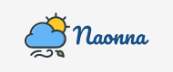

# Project 1 - Naonna

프로젝트 링크

## 목차

- [🧑‍🤝‍🧑 팀원 소개](#팀원-소개)
- [🛠️기술 스택](#기술-스택)
- [✨ 프로젝트 소개](#프로젝트-소개)

### 팀원 소개

#### FrontEnd

|  |  |
| :--------------------------------------------------------------------------------------: | :----------------------------------------------------------------------------------------------: |
|                          [이휘찬](https://github.com/kasterra)                           |                            [장윤성](https://github.com/JangYunSeong)                             |

#### BackEnd

|  |  |
| :------------------------------------------------------------------------------------: | :------------------------------------------------------------------------------------: |
|                          [이민우](https://github.com/lmw7414)                          |                          [이지혁](https://github.com/olzlgur)                          |

#### Data

|  |
| :------------------------------------------------------------------------------------: |
|                          [김은정](https://github.com/ezzkimm)                          |

### 기술 스택

#### Front-End

### Back-end

### Data

### 프로젝트 소개

밖에서 만나는 약속을 잡을 때, 신경쓰지 않을 수 없는 중요한 요소, 날씨! GDSC KNU 1기 프로젝트 1팀에서 제작한 서비스 '나온나'에서. 약속을 잡을 위치를 지정하면, 일주일간의 날씨를 계산해서, 여러분들께 최적의 날씨를 추천해 드립니다!
